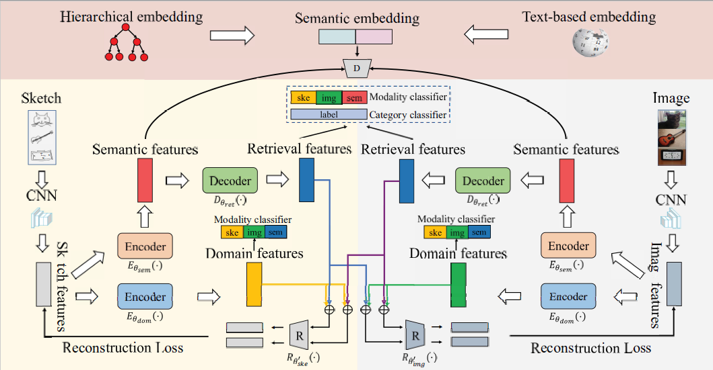

# Progressive Domain-Independent Feature Decomposition Network for Zero-Shot Sketch-Based Image Retrieval(IJCAI 2020)

This project is our Pytorch implementation of **Progressive Domain-Independent Feature Decomposition Network for 
Zero-Shot Sketch-Based Image Retrieval** [[paper](https://doi.org/10.24963/ijcai.2020/137)]



If you find this project helpful, please consider to cite our paper:

```
@inproceedings{ijcai2020-137,
  title     = {Progressive Domain-Independent Feature Decomposition Network for Zero-Shot Sketch-Based Image Retrieval},
  author    = {Xinxun Xu and Muli Yang and Yanhua Yang and Hao Wang},
  booktitle = {Proceedings of the Twenty-Ninth International Joint Conference on Artificial Intelligence, {IJCAI-20}},
  publisher = {International Joint Conferences on Artificial Intelligence Organization},
  pages     = {984--990},
  year      = {2020},
}
```

## Prerequisites

* Linux
* TITAN RTX GPU
* Python 3.7.5
* Pytorch 1.3.0 + torchvision 0.2.1

## Datasets

We use Sketchy and TU-Berlin datasets for zero-shot SBIR, following the same zero-shot data partitioning in [SEMPCYC](https://arxiv.org/abs/1903.03372).


You can download the datasets from [here(passwd:xdXx)](https://pan.baidu.com/s/18TW1Qmwy8_HwP37AlYUdLQ). Then unzip it and put the contents in `./ZS-SBIR` of this project.


## Pre-trained Feature Extractor

The files can be downloaded from [here(passwd:qc22)](https://pan.baidu.com/s/1J25seAOhIYqAFdkAfQH7OQ). Then put four .pth files in `./model`.


## Training

IJCAI model with 64-d features in default setting.

```python
# train with Sketchy Ext dataset
python ys_ijcai.py --dataset Sketchy

# train with TU-Berlin Ext dataset
python ys_ijcai.py --dataset TU-Berlin
```


## Testing

IJCAI model with 64-d features in default setting.

```python
# test with Sketchy Ext dataset
python ys_ijcai.py --dataset Sketchy --test

# test with TU-Berlin Ext dataset
python ys_ijcai.py --dataset TU-Berlin --test
```


## Pre-trained Models

Our trained models for Skethy Ext and TU-Berlin Ext with 64-d features in default setting can be downloaded from [here(passwd:vppy)](https://pan.baidu.com/s/1R4W1xGmMPOgrxwYiZbMkAA). Please put the contents in `./checkpoint/`. 

For example, the path of pre-trained model for Sketchy Ext in default experimental setting should be:

`./checkpoint/ijcai_Sketchy_extended_None_hieremb-jcn+word2vec-google-news_c2f_False_64/model_best.pth`
